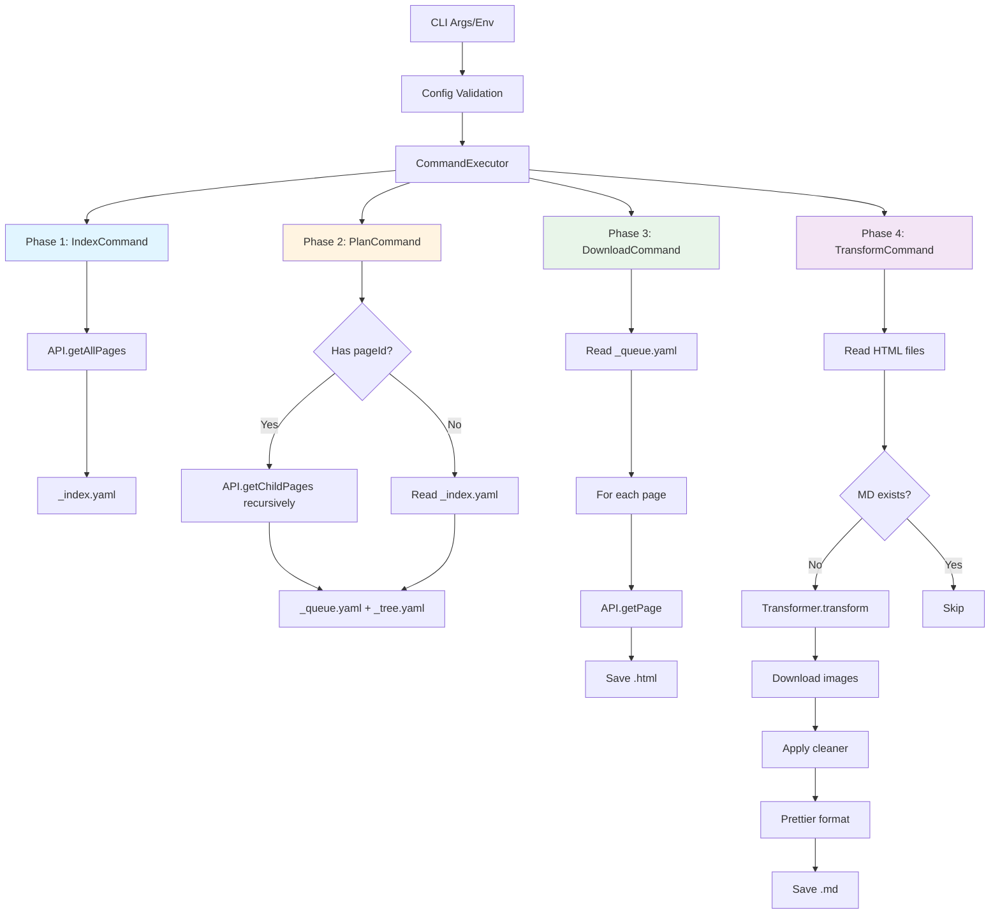
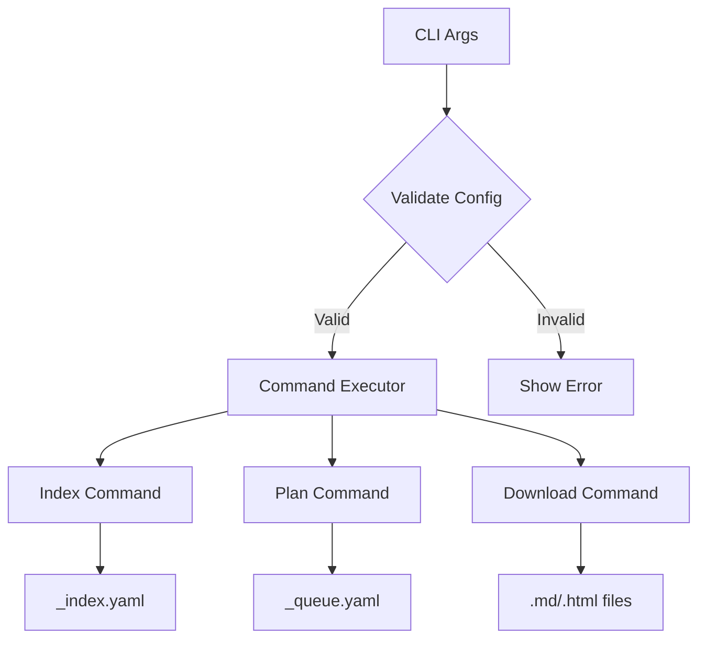
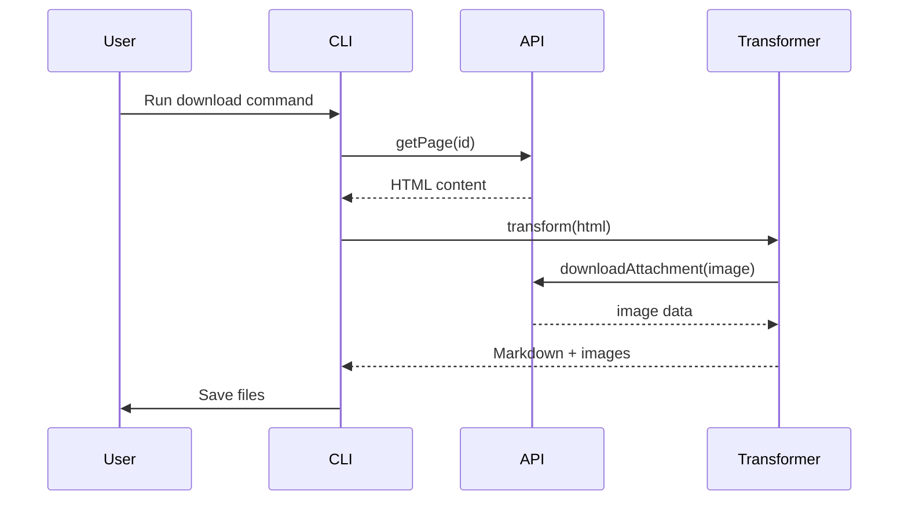

# Agents Guide: Confluence to Markdown Exporter

This document provides comprehensive guidance for AI agents (like GitHub Copilot) working on this project. It includes architecture, patterns, conventions, and implementation details.

> **⚠️ IMPORTANT: Keep This Document Updated**  
> When making changes to project structure, architecture, CLI commands, API methods, or core logic, **ALWAYS update this agents.md file** to reflect those changes. This ensures AI agents have accurate context for future development work.

---

## Project Overview

**Name:** Confluence to Markdown Exporter  
**Type:** CLI Tool  
**Language:** TypeScript 5.x  
**Runtime:** Node.js 18+  
**Purpose:** Export Confluence spaces to Markdown files with metadata preservation

### Key Features
- ✅ Minimal dependencies (uses native Node.js fetch)
- ✅ Command-based CLI with five commands: `help`, `index`, `plan`, `download`, `transform`
- ✅ Four-phase export workflow (indexing → planning → downloading → transforming)
- ✅ Separate HTML download and Markdown transformation for flexibility
- ✅ HTML to Markdown transformation with Confluence macro support
- ✅ User link resolution with intelligent caching
- ✅ Image/attachment downloading with automatic slugification
- ✅ YAML-based indexing with resume capability
- ✅ Prettier formatting for consistent output

### Quick Start

```bash
# Full space export (4-phase workflow)
npm run dev -- index plan download transform -u URL -n USER -p TOKEN -s SPACE -o ./output

# Full space export with limit (process first 10 pages only)
npm run dev -- index plan download transform -u URL -n USER -p TOKEN -s SPACE -o ./output -l 10

# Single page HTML download only
npm run dev -- download -i PAGE_ID -u URL -n USER -p TOKEN -s SPACE -o ./output

# Transform existing HTML files to Markdown
npm run dev -- transform -u URL -n USER -p TOKEN -s SPACE -o ./output

# Resume from existing index
npm run dev -- plan download transform -u URL -n USER -p TOKEN -s SPACE -o ./output
```

---

## Architecture

### Core Components

```
src/
├── index.ts          # CLI entry point (arg parsing, config validation)
├── types.ts          # TypeScript type definitions
├── api.ts            # Confluence REST API client
├── transformer.ts    # HTML → Markdown conversion
├── cleaner.ts        # Post-processing cleanup
└── commands/         # Command handlers (modular architecture)
    ├── types.ts      # Command-related type definitions
    ├── help.command.ts      # Help command handler
    ├── index.command.ts     # Index command handler
    ├── plan.command.ts      # Plan command handler
    ├── download.command.ts  # Download command handler (HTML only)
    ├── transform.command.ts # Transform command handler (HTML → MD)
    ├── registry.ts   # Command registry (maps commands to handlers)
    ├── executor.ts   # Command executor (orchestrates execution)
    └── index.ts      # Exports for easy importing
```

### Data Flow



**Workflow Summary:**
1. **Index Phase** - Scan space and create `_index.yaml` with all page metadata
2. **Plan Phase** - Create `_queue.yaml` from index or specific page tree
3. **Download Phase** - Process queue and download HTML files
4. **Transform Phase** - Convert HTML to Markdown (skips existing MD files)

### Key Design Patterns

#### 1. Command Pattern
Each command is a separate class implementing `CommandHandler` interface:
- **Benefits:** Separation of concerns, testable, extensible
- **Registry:** `CommandRegistry` maps command names to handlers
- **Executor:** `CommandExecutor` orchestrates command execution
- **Commands:** `help`, `index`, `plan`, `download`, `transform`

#### 2. Four-Phase Export Workflow
Separates concerns for resumability and transparency:
- **Phase 1 (Index):** Scan space → `_index.yaml` with metadata
- **Phase 2 (Plan):** Create `_queue.yaml` from index or page tree
- **Phase 3 (Download):** Process queue → download HTML files only
- **Phase 4 (Transform):** Convert HTML to Markdown (checks for existing MD files)

#### 3. Async Generators
Memory-efficient pagination in `api.getAllPages()`:
- Yields pages one at a time
- Avoids loading entire space into memory
- Enables progress tracking

#### 4. Smart Caching
Optimizes API calls:
- User lookups cached in `Map<string, User>`
- Prevents duplicate API requests
- Reduces export time

#### 5. Error Handling Strategy
- **Non-fatal:** Logged as warnings (e.g., failed image downloads)
- **Fatal:** Throw error and exit with code 1 (e.g., API auth failure)

---

## Type System

### Configuration
```typescript
interface ConfluenceConfig {
  baseUrl: string;         // Confluence instance URL
  username: string;        // Email/username
  password: string;        // API token
  spaceKey: string;        // Space identifier
  outputDir: string;       // Export destination
  pageId?: string;         // Optional: single page export
  pageSize?: number;       // Optional: pagination size (default: 25)
  limit?: number;          // Optional: limit number of pages to process
}
```

### Core Domain
```typescript
interface Page {
  id: string;
  title: string;
  body: string;            // HTML storage format
  version?: number;
  parentId?: string;
  modifiedDate?: string;
}

interface PageIndexEntry {
  id: string;
  title: string;
  version?: number;
  parentId?: string;
  modifiedDate?: string;
  indexedDate: string;     // When indexed
  pageNumber: number;      // API page number
}

interface PageTreeNode {
  id: string;
  title: string;
  version?: number;
  parentId?: string;
  modifiedDate?: string;
  children?: PageTreeNode[];  // Hierarchical structure
}
```

### Transformation
```typescript
interface MarkdownResult {
  content: string;         // Markdown body
  frontMatter: {           // YAML front matter
    title: string;
    id: string;
    version?: number;
    parentId?: string;
  };
  images: Array<{          // Downloaded images
    filename: string;
    data: Buffer;
  }>;
}
```

---

## API Client (api.ts)

### Authentication
- Uses HTTP Basic Auth with base64-encoded credentials
- Token stored in `authHeader` property

### Key Methods

#### `getPage(pageId: string): Promise<Page>`
Fetches a single page with full content.
- Expands: `body.storage`, `version`, `history.lastUpdated`
- Returns: Normalized `Page` object

#### `listPages(spaceKey, start, limit): Promise<PaginatedResponse<Page>>`
Fetches paginated page list from a space.
- Includes body content (use for small exports only)
- Returns: Results + pagination metadata

#### `getAllPages(spaceKey, pageSize, startFrom): AsyncGenerator<Page & {apiPageNumber}>`
Memory-efficient async generator for all pages.
- Handles pagination automatically
- Yields pages one at a time
- Tracks API page number for logging
- **Resume support:** `startFrom` parameter allows starting from a specific position (efficient resume without fetching already-indexed pages)

#### `getChildPages(pageId): Promise<Page[]>`
Fetches child pages for hierarchy resolution.
- Used by `list-children` macro transformation
- Returns page IDs and titles only (no body)

#### `downloadAttachment(pageId, filename): Promise<Buffer | null>`
Downloads binary attachment data.
- Returns null on failure (non-fatal)
- Used for image downloads

#### `getUserByUsername(username): Promise<User | null>`
#### `getUserByKey(userKey): Promise<User | null>`
Resolve user links to display names.
- Results cached in `userCache` Map
- Returns null on failure (falls back to username)

---

## Commands (src/commands/)

The application uses a modular command architecture where each command is self-contained.

### Command Reference

| Command | Purpose | Output | Resume Support |
|---------|---------|--------|----------------|
| `help` | Display usage information | Console output | N/A |
| `index` | Create page inventory | `_index.yaml` | ✅ Yes |
| `plan` | Create download queue and tree | `_queue.yaml` + `_tree.yaml` | ❌ No |
| `download` | Download HTML pages | `.html` files | ❌ No |
| `transform` | Transform HTML to Markdown | `.md` files + images | ✅ Yes (skips existing) |

### Command Handlers

#### HelpCommand (`help.command.ts`)
```bash
npm run dev -- help
```
Displays usage information, options, and examples.

#### IndexCommand (`index.command.ts`)
```bash
npm run dev -- index -u URL -n USER -p TOKEN -s SPACE -o ./output

# With limit (index only first 10 pages)
npm run dev -- index -u URL -n USER -p TOKEN -s SPACE -o ./output -l 10
```
**Purpose:** Create complete page inventory (Phase 1)

**Behavior:**
- Creates output directory if missing
- Streams all pages via `api.getAllPages()` (memory-efficient)
- Appends each page to `_index.yaml` as YAML array entry
- **Resume:** Automatically resumes from where it left off by calculating the start position from existing pages (does NOT re-fetch already-indexed pages)
- **Limit:** If `--limit` is specified, stops after indexing that many pages
- **Logging:** `[N] Indexed: Title (ID) [API Page N]`

**Output:** `_index.yaml` with metadata for all pages in space

#### PlanCommand (`plan.command.ts`)
```bash
# Plan entire space (from index)
npm run dev -- plan -u URL -n USER -p TOKEN -s SPACE -o ./output

# Plan specific page tree
npm run dev -- plan -i PAGE_ID -u URL -n USER -p TOKEN -s SPACE -o ./output

# Plan with limit (first 10 pages from index)
npm run dev -- plan -u URL -n USER -p TOKEN -s SPACE -o ./output -l 10
```
**Purpose:** Create download queue and tree structure (Phase 2)

**Behavior:**
- **Mode A (No pageId):** Reads `_index.yaml` → creates `_queue.yaml` (flat) + `_tree.yaml` (hierarchical)
- **Mode B (With pageId):** Fetches page tree recursively → creates `_queue.yaml` + `_tree.yaml`
- Uses `collectPageTree()` for recursive hierarchy traversal
- Uses `buildTreeFromIndex()` to construct tree from flat index
- **Limit:** If `--limit` is specified, only includes first N pages in queue
- **Logging:** `[N] Found: Title (ID)` (indented for hierarchy)

**Output:** 
- `_queue.yaml` - Flat list of pages to download (depth-first order)
- `_tree.yaml` - Hierarchical tree structure showing parent-child relationships

#### DownloadCommand (`download.command.ts`)
```bash
# Download from queue
npm run dev -- download -u URL -n USER -p TOKEN -s SPACE -o ./output

# Download single page directly
npm run dev -- download -i PAGE_ID -u URL -n USER -p TOKEN -s SPACE -o ./output
```
**Purpose:** Download HTML pages (Phase 3)

**Behavior:**
- **Mode A (No pageId):** Requires `_queue.yaml` to exist (throws error if missing)
- **Mode B (With pageId):** Downloads single page directly (no queue needed)
- For each page:
  1. Fetch via `api.getPage(id)`
  2. Format HTML with Prettier
  3. Save `.html` file
- **Limit:** If `--limit` is specified, only downloads first N pages from queue
- **Logging:** `[N/Total] Downloading: Title (ID)`

**Output:** HTML files only

#### TransformCommand (`transform.command.ts`)
```bash
# Transform all HTML files in output directory
npm run dev -- transform -u URL -n USER -p TOKEN -s SPACE -o ./output
```
**Purpose:** Transform HTML to Markdown (Phase 4)

**Behavior:**
- Scans output directory for `.html` files
- For each HTML file:
  1. Check if corresponding `.md` file exists
  2. If `.md` exists, skip (no overwrite)
  3. If `.md` missing, transform HTML to Markdown
  4. Download images to `images/` subdirectory
  5. Apply cleaner and format with Prettier
  6. Save `.md` file
- **Limit:** If `--limit` is specified, only processes first N HTML files
- **Logging:** `[N/Total] Checking: file.html`
- **Smart Skip:** Only transforms pages missing Markdown files

**Output:** Markdown files and downloaded images (skips existing MD files)

### Export Modes

#### Mode 1: Single Page Export
When `config.pageId` is set (via `download` command):
1. Fetch single page via `api.getPage(pageId)`
2. Save .html file
3. Run `transform` command separately to generate .md

#### Mode 2: Full Space Export
When `config.pageId` is undefined (via `index`, `plan`, `download`, and `transform` commands):

**Phase 1: Create Index** (`IndexCommand`)
1. Check if `_index.yaml` exists (resume if found)
2. Stream pages via `api.getAllPages()`
3. Append each page as YAML array entry
4. Log: `[N] Indexed: Title (ID) [API Page N]`

**Phase 2: Create Queue** (`PlanCommand`)
1. Option A: From _index.yaml (no pageId)
   - Read `_index.yaml`
   - Copy to `_queue.yaml`
2. Option B: From specific page tree (with pageId)
   - Fetch page via `api.getPage(pageId)`
   - Recursively fetch all children via `api.getChildPages()`
   - Write to `_queue.yaml`

**Phase 3: Download Pages** (`DownloadCommand`)
1. Check for `_queue.yaml` (required, throws error if missing)
2. For each entry:
   - Fetch full page via `api.getPage(id)`
   - Format with Prettier
   - Save .html file
3. Log: `[N/Total] Downloading: Title (ID)`

**Phase 4: Transform Pages** (`TransformCommand`)
1. Scan output directory for .html files
2. For each HTML file:
   - Check if .md exists (skip if found)
   - Transform HTML to markdown
   - Download images
   - Apply cleaner
   - Format with Prettier
   - Save .md file
3. Log: `[N/Total] Checking: file.html`

### Common Workflows

```bash
# Workflow 1: Full space export (all phases)
npm run dev -- index plan download transform -u URL -n USER -p TOKEN -s SPACE -o ./output

# Workflow 2: Resume from existing index
npm run dev -- plan download transform -u URL -n USER -p TOKEN -s SPACE -o ./output

# Workflow 3: Export specific page and children
npm run dev -- plan download transform -i PAGE_ID -u URL -n USER -p TOKEN -s SPACE -o ./output

# Workflow 4: Single page only (fastest)
npm run dev -- download -i PAGE_ID -u URL -n USER -p TOKEN -s SPACE -o ./output

# Workflow 5: Re-index space (update metadata)
rm ./output/_index.yaml
npm run dev -- index -u URL -n USER -p TOKEN -s SPACE -o ./output
```

### File Structure

```
outputDir/
├── _index.yaml         # Page index (YAML array)
├── _queue.yaml         # Download queue (YAML array)
├── _tree.yaml          # Hierarchical page tree structure (NEW)
├── page-title-1.md     # Formatted markdown
├── page-title-1.html   # Original HTML (formatted)
├── page-title-2.md
├── page-title-2.html
└── images/
    ├── image-1.png
    └── image-2.jpg
```

### Filename Slugification
```typescript
slugify(text: string): string {
  return text
    .toLowerCase()
    .replace(/[^\w\s-]/g, '')  // Remove special chars
    .replace(/\s+/g, '-')      // Spaces → hyphens
    .replace(/-+/g, '-')       // Collapse hyphens
    .trim();
}
```

### Front Matter Format
```yaml
---
title: "Page Title"
id: "123456789"
url: "https://site.atlassian.net/pages/viewpage.action?pageId=123456789"
version: 5
parentId: "987654321"
---
```

### Prettier Formatting

**Markdown:**
- `printWidth: 120`
- `proseWrap: 'preserve'` (don't reflow text)
- `tabWidth: 2`

**HTML:**
- `printWidth: 120`
- `htmlWhitespaceSensitivity: 'ignore'`
- Consistent 2-space indentation

Formatting failures are non-fatal (saves unformatted with warning).

---

## CLI (index.ts)

### Command Structure
The CLI uses a command-based architecture with five commands:

| Command | Purpose | Required Files | Output |
|---------|---------|----------------|--------|
| `help` | Display help | None | Console |
| `index` | Scan space pages | None | `_index.yaml` |
| `plan` | Create download queue | `_index.yaml` (if no pageId) | `_queue.yaml` |
| `download` | Download HTML pages | `_queue.yaml` (if no pageId) | `.html` files |
| `transform` | Transform HTML to MD | `.html` files | `.md` files + images |

**Chaining:** Commands can be chained to run in sequence:
```bash
npm run dev -- index plan download transform -u URL -n USER -p TOKEN -s SPACE
```

### Argument Parsing
Uses `minimist` for flexible CLI arguments.

```bash
# Show help (no commands or --help flag)
node index.js
node index.js help
node index.js --help

# Create index only (Phase 1)
node index.js index -u https://site.atlassian.net \
              -n user@example.com \
              -p token123 \
              -s MYSPACE \
              -o ./export

# Create queue from existing index
node index.js plan -u https://site.atlassian.net \
              -n user@example.com \
              -p token123 \
              -s MYSPACE \
              -o ./export

# Create queue for specific page and all children
node index.js plan -i 123456789 -u https://site.atlassian.net \
              -n user@example.com \
              -p token123 \
              -s MYSPACE \
              -o ./export

# Download from existing queue or index (Phase 2)
node index.js download -u https://site.atlassian.net \
              -n user@example.com \
              -p token123 \
              -s MYSPACE \
              -o ./export

# Run both phases in sequence
node index.js index download -u URL -n USER -p PASS -s SPACE

# Download single page (no index/queue needed)
node index.js download -i 123456789 -u URL -n USER -p PASS -s SPACE

# Short flags
node index.js download -u URL -n USER -p PASS -s SPACE -o DIR -i ID
```

### Command Behavior

1. **No commands provided**: Shows help and exits
2. **Invalid command**: Shows error + help and exits with code 1
3. **Multiple commands**: Executes in sequence with visual separators
4. **`help` command**: Shows help and exits (other commands ignored)
5. **`plan` with pageId**: Creates _queue.yaml with specified page and all children
6. **`plan` without pageId**: Creates _queue.yaml from existing _index.yaml
7. **`download`**: Requires _queue.yaml to exist (errors if missing with instruction to run plan)
8. **`transform`**: Scans for .html files and creates .md files (skips if .md exists)

### Options

| Flag | Long Form | Description | Default |
|------|-----------|-------------|---------|
| `-u` | `--url` | Confluence base URL | env: `CONFLUENCE_BASE_URL` |
| `-n` | `--username` | Username/email | env: `CONFLUENCE_USERNAME` |
| `-p` | `--password` | API token | env: `CONFLUENCE_PASSWORD` |
| `-s` | `--space` | Space key | env: `CONFLUENCE_SPACE_KEY` |
| `-o` | `--output` | Output directory | `./output` or env: `OUTPUT_DIR` |
| `-i` | `--pageId` | Single page ID (optional) | none |
| `-l` | `--limit` | Limit number of pages to process | none |
| | `--pageSize` | API page size | `25` |
| `-h` | `--help` | Show help | |

### Environment Variables
Fallback if CLI args not provided:
- `CONFLUENCE_BASE_URL`
- `CONFLUENCE_USERNAME`
- `CONFLUENCE_PASSWORD`
- `CONFLUENCE_SPACE_KEY`
- `OUTPUT_DIR`

### Validation
Required fields (for `index`, `download`, and `transform` commands):
- `baseUrl`
- `username`
- `password`
- `spaceKey`

Exits with code 1 and error message if missing.

### Help Text
```bash
node index.js
node index.js help
node index.js --help
```
Shows usage, commands, options, environment variables, and examples.

---

## Development Workflow

### Build & Run

```bash
# Build TypeScript
npm run build          # Uses Vite
npm run build:tsc      # Uses tsc directly

# Run compiled
npm start -- [args]

# Development mode
npm run dev -- [args]           # Run once
npm run dev:watch -- [args]     # Watch mode
```

### Testing

```bash
npm test                        # Run all tests
npm run test:watch              # Watch mode
npm run test:coverage           # With coverage
```

### Linting & Type Checking

```bash
npm run lint                    # ESLint
npm run typecheck               # TypeScript --noEmit
```

### Cleaning

```bash
npm run clean                   # Remove dist/
npm run rebuild                 # Clean + build
```

---

## Coding Conventions

### TypeScript Style

1. **Explicit Types**
   - Always type function parameters
   - Always type function return values
   - Use interfaces for objects, type aliases for unions

2. **Imports**
   - Use `.js` extension in imports (ES modules)
   - Import types with `import type {}`
   - Order: types, then classes, then functions

3. **Async/Await**
   - Prefer async/await over Promises
   - Use `for await...of` for async generators
   - Handle errors with try/catch

4. **Error Handling**
   - Throw `Error` objects with descriptive messages
   - Log warnings to console for non-fatal errors
   - Return null for optional operations that fail

5. **Naming**
   - Classes: PascalCase (e.g., `ConfluenceApi`)
   - Functions/methods: camelCase (e.g., `getPage`)
   - Constants: UPPER_SNAKE_CASE (e.g., `DEFAULT_PAGE_SIZE`)
   - Interfaces: PascalCase (e.g., `ConfluenceConfig`)

### Documentation

```typescript
/**
 * Brief description of function/class
 * 
 * Detailed explanation if needed.
 * 
 * @param paramName - Description
 * @returns Description
 * @throws ErrorType - When error occurs
 */
```

### Diagrams

**Using Mermaid:**
When documenting architecture, data flows, or complex relationships, use Mermaid diagrams in markdown files. Mermaid is supported by GitHub, VS Code, and many markdown viewers.

**Supported Diagram Types:**
- `flowchart` / `graph` - Flow diagrams and directed graphs
- `sequenceDiagram` - Sequence/interaction diagrams
- `classDiagram` - Class relationships
- `stateDiagram` - State machines
- `erDiagram` - Entity-relationship diagrams
- `gantt` - Gantt charts for timelines
- `architecture-beta` - Architecture diagrams (experimental)

**Example - Architecture Diagram:**

```mermaid
architecture-beta
    service user(mdi:account)[User]
    service cli(logos:terminal)[CLI]
    service api(logos:aws-lambda)[Confluence API]
    service transformer(mdi:transform)[Transformer]
    service files(mdi:file-document)[Output Files]

    user:R --> L:cli
    cli:R --> L:api
    cli:R --> L:transformer
    transformer:R --> L:files
```


**Example - Flow Diagram:**


**Example - Sequence Diagram:**


**Best Practices:**
1. Use diagrams to complement text documentation, not replace it
2. Keep diagrams simple and focused on one concept
3. Add descriptive labels to nodes and edges
4. Place diagrams near the relevant text explanation
5. Use consistent naming with code (class names, method names)
6. Test diagram rendering in your markdown viewer

### File Organization

```typescript
// 1. Imports
import type { TypeA, TypeB } from './types.js';
import { ClassA } from './class-a.js';

// 2. Constants
const DEFAULT_VALUE = 42;

// 3. Interfaces (if not in types.ts)
interface LocalType { ... }

// 4. Class/function implementation
export class MyClass { ... }

// 5. Helper functions (private)
function helperFunction() { ... }
```

---

## Common Tasks

### Adding a New Macro Transformation

1. Identify macro pattern in Confluence HTML:
   ```html
   <ac:structured-macro ac:name="macro-name">
     <!-- content -->
   </ac:structured-macro>
   ```

2. Add regex replacement in `transformer.ts` → `transformMacros()`:
   ```typescript
   result = result.replace(
     /<ac:structured-macro[^>]*ac:name="macro-name"[^>]*>(.*?)<\/ac:structured-macro>/gis,
     '<!-- Macro: macro-name -->\n$1\n'
   );
   ```

3. Test with sample page containing macro

### Adding a New CLI Option

1. Add to `minimist` config in `index.ts`:
   ```typescript
   const args = minimist(process.argv.slice(2), {
     string: ['url', 'username', ..., 'newOption'],
     alias: { o: 'newOption' }
   });
   ```

2. Add to config building:
   ```typescript
   const config: ConfluenceConfig = {
     // ...
     newOption: args.newOption || process.env.NEW_OPTION || 'default'
   };
   ```

3. Update help text
4. Update type definition in `types.ts`

### Adding a New API Endpoint

1. Add response interface to `types.ts`:
   ```typescript
   export interface NewEndpointResponse {
     // fields
   }
   ```

2. Add method to `api.ts`:
   ```typescript
   async newEndpoint(param: string): Promise<Result> {
     const url = `${this.baseUrl}/rest/api/endpoint/${param}`;
     const response = await fetch(url, {
       headers: {
         'Authorization': this.authHeader,
         'Accept': 'application/json'
       }
     });
     // ... error handling, parsing
     return data;
   }
   ```

3. Call from transformer or runner as needed

### Adding a Cleanup Pattern

1. Add pattern to `cleaner.ts`:
   ```typescript
   // In clean() or cleanConfluencePatterns()
   cleaned = cleaned.replace(/pattern/g, 'replacement');
   ```

2. Add comment explaining what it fixes
3. Test with malformed markdown sample

---

## Testing Guidelines

### Test Coverage

The project has **test coverage** for core functionality and basic command structure:

**Command Tests** (`tests/commands/`):
- ✅ `help.command.test.ts` - Basic instantiation test
- ✅ `index.command.test.ts` - Basic instantiation test  
- ✅ `plan.command.test.ts` - Basic instantiation test
- ✅ `download.command.test.ts` - Basic instantiation test
- ✅ `transform.command.test.ts` - Basic instantiation test

**Core Functionality Tests** (`tests/`):
- ✅ `transformer.test.ts` - HTML to Markdown transformation (7 tests)
- ✅ `cleaner.test.ts` - Markdown cleanup patterns (9 tests)

**Note:** Command tests are basic because commands create their own `ConfluenceApi` instances internally, which cannot be easily mocked with Jest + ESM modules. To enable full command testing, commands would need refactoring to use dependency injection.

### Test Architecture

Uses **manual mock classes** compatible with ESM:

```typescript
// Manual mock class for API (used in transformer tests)
class MockApi implements Partial<ConfluenceApi> {
  async getPage(id: string): Promise<Page> {
    return mockPageData;
  }
}

// Console output capture
let consoleOutput: string[];
beforeEach(() => {
  consoleOutput = [];
  console.log = (...args: unknown[]) => {
    consoleOutput.push(args.join(' '));
  };
});
```

### Test Structure

All tests follow consistent AAA pattern:

```typescript
describe('CommandName', () => {
  let command: CommandClass;
  let mockContext: CommandContext;
  
  beforeEach(() => {
    // Arrange - Setup mocks and context
    command = new CommandClass();
    mockContext = { config: {...}, args: {} };
  });
  
  afterEach(() => {
    // Cleanup - Remove temp files, restore console
  });
  
  describe('feature group', () => {
    it('should do something specific', async () => {
      // Arrange - Prepare test data
      // Act - Execute the command
      // Assert - Verify results
    });
  });
});
```

### Running Tests

```bash
# Run all tests
npm test

# Run tests in watch mode
npm run test:watch

# Run tests with coverage
npm run test:coverage

# Run specific test file
npm test -- help.command.test.ts

# Run tests matching pattern
npm test -- --testNamePattern="should transform"
```

### Coverage Summary

| Component | Test File | Coverage |
|-----------|-----------|----------|
| Help Command | `help.command.test.ts` | ✅ Basic |
| Index Command | `index.command.test.ts` | ✅ Basic |
| Plan Command | `plan.command.test.ts` | ✅ Basic |
| Download Command | `download.command.test.ts` | ✅ Basic |
| Transform Command | `transform.command.test.ts` | ✅ Basic |
| HTML→MD Transformer | `transformer.test.ts` | ✅ Complete (7 tests) |
| Markdown Cleaner | `cleaner.test.ts` | ✅ Complete (9 tests) |

**Test Coverage Areas:**
- ✅ Command instantiation
- ✅ HTML to Markdown conversion
- ✅ Confluence macro transformations  
- ✅ User link resolution
- ✅ Markdown cleanup patterns
- ⚠️ Full command execution workflows (requires DI refactoring)

See `tests/commands/README.md` for detailed test documentation.

### Improving Test Coverage

To enable full command testing:

1. **Refactor for Dependency Injection**
   ```typescript
   // Instead of creating API internally:
   export class IndexCommand implements CommandHandler {
     async execute(context: CommandContext): Promise<void> {
       const api = new ConfluenceApi(config); // Hard to mock
       // ...
     }
   }
   
   // Use dependency injection:
   export class IndexCommand implements CommandHandler {
     constructor(private api?: ConfluenceApi) {}
     
     async execute(context: CommandContext): Promise<void> {
       const api = this.api || new ConfluenceApi(config); // Easy to mock
       // ...
     }
   }
   ```

2. **Add Integration Tests**
   - Use recorded API responses (fixtures)
   - Test full workflows end-to-end
   - Validate file outputs

---

## Troubleshooting

### Common Issues

**Issue: "Failed to fetch page: 401 Unauthorized"**
- Solution: Check API token validity, ensure username is correct email

**Issue: Empty markdown files**
- Solution: Check if page body is in storage format (not view/export format)

**Issue: Images not downloading**
- Solution: Verify attachment exists on page, check filename encoding

**Issue: Malformed markdown (e.g., `## **`)**
- Solution: Run through cleaner, add new pattern if needed

**Issue: Index.yaml incomplete**
- Solution: Delete index.yaml and restart (resumable from any point)

### Debug Mode

Enable verbose logging:
```typescript
// In command handlers or api.ts
console.log('[DEBUG]', detailedInfo);
```

### API Rate Limiting

Confluence Cloud has rate limits:
- Consider adding delays: `await new Promise(r => setTimeout(r, 100));`
- Use smaller `pageSize` if hitting limits

---

## Dependencies

### Runtime
- `minimist`: ^1.2.8 - CLI argument parsing
- `dotenv`: ^17.2.3 - Environment variable loading
- `prettier`: ^3.6.2 - Code formatting
- `yaml`: ^2.8.1 - YAML parsing/stringifying

### Development
- `typescript`: ^5.0.0 - TypeScript compiler
- `vite`: ^7.1.10 - Build tool
- `vite-node`: ^3.2.4 - Development runner
- `jest`: ^30.2.0 - Testing framework
- `ts-jest`: ^29.4.5 - TypeScript Jest support
- `@types/node`: ^20.0.0 - Node.js type definitions
- `@types/jest`: ^30.0.0 - Jest type definitions
- `@types/minimist`: ^1.2.5 - Minimist type definitions

---

## Future Enhancements

### Potential Features
- [ ] Incremental exports (only changed pages)
- [ ] Link rewriting (internal page references)
- [ ] Attachment downloads (all file types)
- [ ] Custom macro handlers (plugin system)
- [ ] Multi-space exports
- [ ] Parallel downloads (with concurrency limit)
- [ ] Export to other formats (HTML, PDF)
- [ ] Page hierarchy preservation in directory structure
- [ ] Git integration (commit per page)

### Known Limitations
- Basic HTML conversion (may miss edge cases)
- No retry logic for failed API calls
- No progress persistence within a single page
- Limited macro support (only common ones)
- No table formatting improvements

---

## Resources

### Confluence REST API
- [Confluence Cloud REST API](https://developer.atlassian.com/cloud/confluence/rest/v1/intro/)
- [Storage Format Reference](https://confluence.atlassian.com/doc/confluence-storage-format-790796544.html)

### TypeScript
- [TypeScript Handbook](https://www.typescriptlang.org/docs/)
- [ES Modules in Node.js](https://nodejs.org/api/esm.html)

### Markdown
- [CommonMark Spec](https://commonmark.org/)
- [GitHub Flavored Markdown](https://github.github.com/gfm/)

---

## License

MIT - Same as parent project

---

## Maintainer Notes

**Last Updated:** October 17, 2025  
**Agent Compatibility:** Optimized for GitHub Copilot, Claude, GPT-4  
**Document Version:** 2.1.0

### When to Update This Document

Update `agents.md` whenever you make changes to:
- ✏️ Project architecture or design patterns
- ✏️ CLI commands, arguments, or workflows
- ✏️ API methods or core functionality
- ✏️ File structure or naming conventions
- ✏️ Coding standards or best practices

Keeping this document current ensures AI agents have accurate context for development work.
